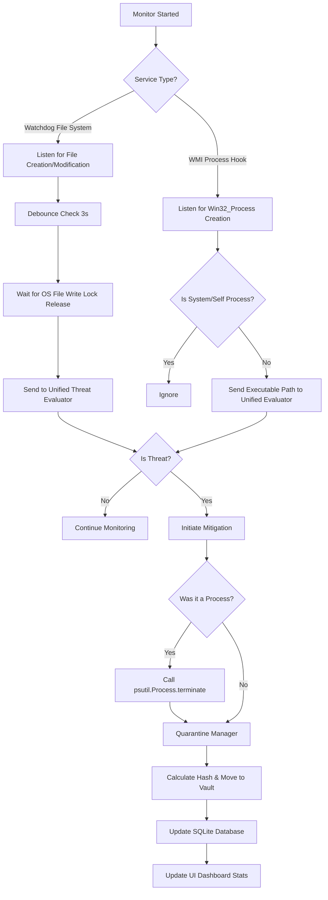

# SentinelX Architecture & Flow 🧠

This document details the internal systems, algorithms, and logical flows employed by SentinelX to detect and mitigate threats.

---

## 1. Unified Threat Evaluation Algorithm

The core of SentinelX’s decision making is the `CoreScanner.evaluate_threat` function. It implements a unified scoring mechanism designed to weigh different indicators before deciding if a file is safe or malicious.

**Algorithm Steps:**
1. **Bypass Checks:** If the file is strictly meant to be a non-executable (e.g. `.pdf`, `.docx`, `.txt`), immediately exit and mark as `Clean` to prevent false positives.
2. **YARA Phase (Weight: +100):** Check the file against 1,150+ compiled signature rules. If *any* match occurs, score increases by 100 heavily skewing the result toward malicious.
3. **Machine Learning Phase (Weight: Variable):** Extract PE characteristics (entropy, sections, suspicious imports) and feed them to the pre-trained `XGBoost` model. The model outputs an anomaly probability score.
4. **VirusTotal Phase (Weight: Cloud Verification):** If enabled, look up the file's MD5 hash.
   - If VT returns `< 3` detections: `Clean` (False Positive override)
   - If VT returns `>= 3` detections: Threat Score `+50`
5. **Verdict Generation:**
   - **Score >= 100**: `Malicious` (or inherited YARA rule name)
   - **Score < 100**: `Clean`

---

## 2. Real-Time Protection Flow Chart

The background protections operate purely async across separate daemon threads.

## 3. Quarantining Algorithm

When a threat is detected, SentinelX ensures it is completely defanged without destroying the proof:
1. Extract the file's inherent MD5 hash.
2. Generate an isolated payload filename: `[MD5]_[OriginalName].isolated`.
3. Perform a safe OS-level move (`shutil.move`) from the origin path to the `quarantine/` directory.
4. Log the `Original Path`, `Quarantine Path`, and `Hash` into the `SQLite3` `quarantine_records` table, allowing the UI to offer 1-click Restorations if a false positive is proven.
